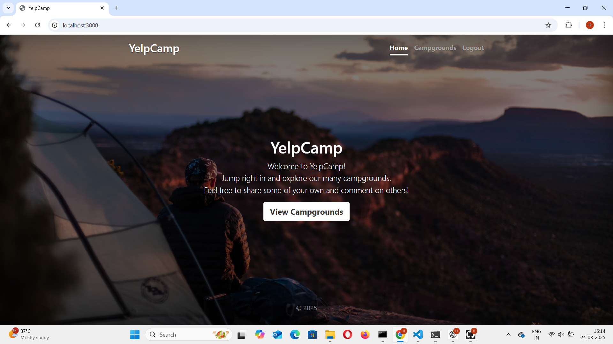
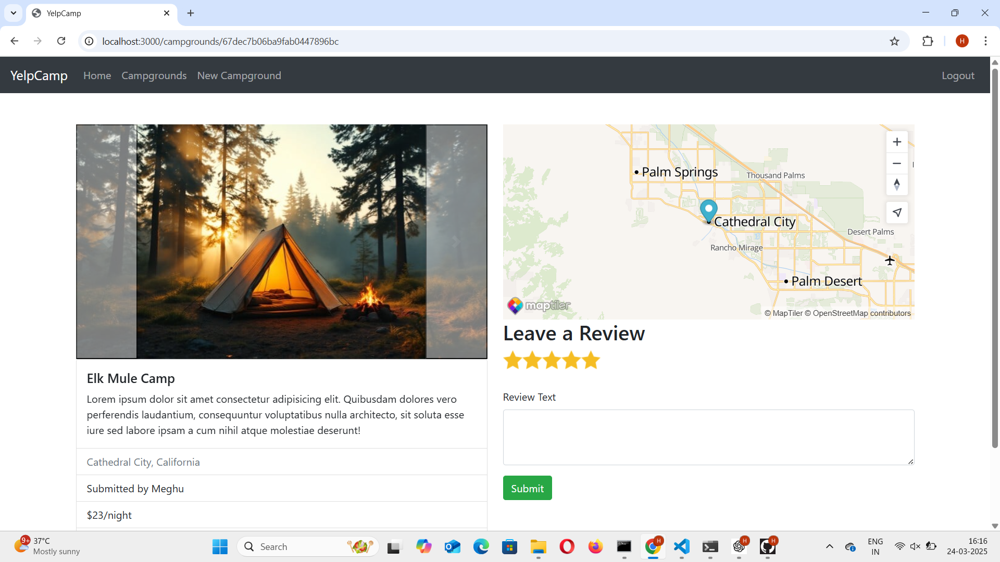
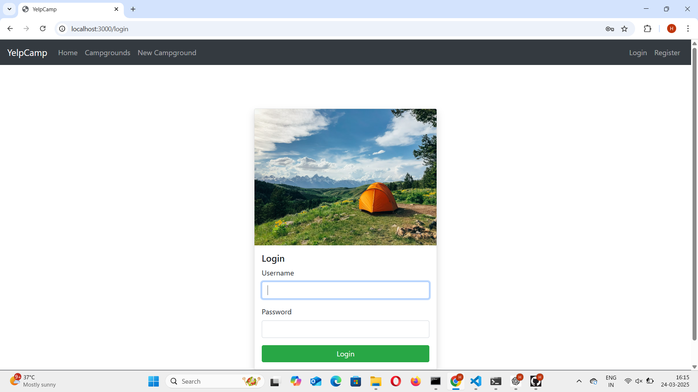

# 🌎 YelpCamp - The Ultimate US-Based Camping Platform

Welcome to **YelpCamp**, your go-to platform for discovering and sharing the best campsites across the United States! 🚀


## 📌 Table of Contents
- [About the Project](#about-the-project)
- [Live Demo](#live-demo)
- [Features](#features)
- [Technologies Used](#technologies-used)
- [Installation & Setup](#installation--setup)
- [Usage](#usage)
- [Project Structure](#project-structure)
- [Screenshots](#screenshots)
- [Contributing](#contributing)
- [Contact](#contact)

---

## 🏕️ About the Project
YelpCamp is a **full-stack web application** that allows users to browse, review, and add campsites across the United States. Whether you’re an adventure seeker or a casual traveler, YelpCamp helps you find the perfect camping spot!

---

## 🌍 Live Demo
🚀 **Check out the live version:**  https://yelpcamp-k632.onrender.com/

---

## ✨ Features
✅ Browse thousands of US-based campsites 🌲  
✅ Add new campsites with images 📸  
✅ Leave reviews & ratings ⭐  
✅ Secure authentication & authorization 🔐  
✅ Interactive maps with campsite locations 🗺️  
✅ Responsive & mobile-friendly UI 📱  
✅ Error handling for a seamless experience ⚡  

---

## 💻 Technologies Used
- **Frontend:** HTML, CSS, JavaScript, Bootstrap
- **Backend:** Node.js, Express.js
- **Database:** MongoDB, Mongoose
- **Authentication:** Passport.js
- **Mapping Service:** MapTiler
- **Hosting:** Render (Deployment)
- **Other:** EJS for templating, Cloudinary for image uploads

---

## ⚡ Installation & Setup

### 📦 Prerequisites
Ensure you have the following installed:
- [Node.js](https://nodejs.org/) (v16+ recommended)
- [MongoDB](https://www.mongodb.com/try/download/community) (or use MongoDB Atlas for cloud database)

### 🔧 Setup Instructions
1️⃣ **Clone the repository**
```bash
git clone https://github.com/your-username/yelpcamp.git
cd yelpcamp
```

2️⃣ **Extract `node_modules.zip` (if provided)**
> Place the `node_modules` folder inside the root directory.

3️⃣ **Install dependencies** (if node_modules is missing)
```bash
npm install
```

4️⃣ **Set up environment variables**
> Create a `.env` file in the root directory and add:
```env
PORT=3000
MONGO_URI=your_mongodb_connection_string
MAPTILER_API_KEY=your_maptiller_api_key
SESSION_SECRET=your_secret_key
CLOUDINARY_CLOUD_NAME=your_cloud_name
CLOUDINARY_API_KEY=your_api_key
CLOUDINARY_API_SECRET=your_api_secret
```

5️⃣ **Start the development server**
```bash
npm start
```
🚀 App will be running on **http://localhost:3000**

---

## 🎯 Usage
1. **Sign up or log in** to explore YelpCamp.
2. **Browse campsites** across the US.
3. **View campsite details**, including images and reviews.
4. **Add your own campsite** and upload images.
5. **Leave reviews & ratings** for campsites.

---

## 📂 Project Structure
```
YelpCamp/
│── models/           # Database models
│── routes/           # Express route handlers
│── public/           # Static assets (CSS, JS, Images)
│── views/            # EJS templates
│── middleware/       # Custom middleware functions
│── app.js            # Main server file
│── package.json      # Project dependencies
│── .env              # Environment variables (not included in repo)
```

---

## 🖼️ Screenshots

### 🏕️ Home Page


### 📌 Campsite Details Page


### 🔐 Login Page


---

## 🤝 Contributing
Contributions are welcome! If you’d like to contribute:
1. Fork the repository 🍴
2. Create a new branch (`git checkout -b feature-branch`)
3. Make your changes and commit (`git commit -m "Your message"`)
4. Push to your branch (`git push origin feature-branch`)
5. Open a pull request! 🚀


---

## 📩 Contact
💡 Have questions? Reach out to me:
- **GitHub:** [Mekala0107](https://github.com/your-Mekala0107)
- **Email:** mekalaselvi01@gmail.com

🚀 **Happy Camping!** 🏕️🔥
